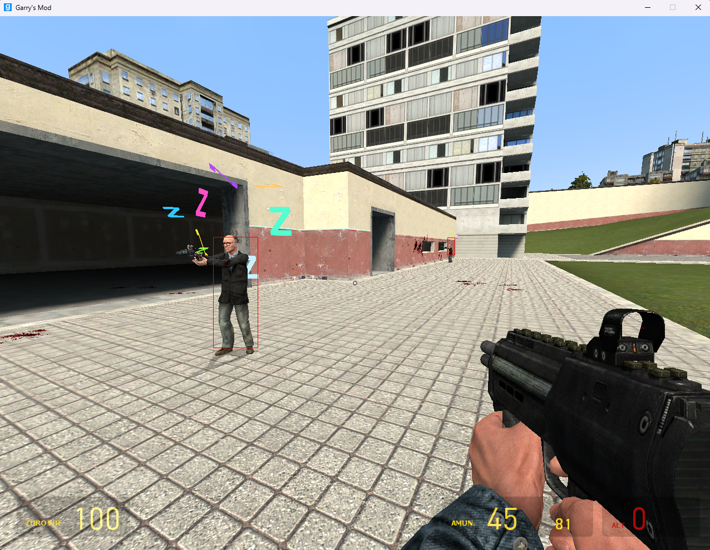

[Timeline 1.mp4](Timeline%201.mp4)


# Gmod ESP
Simple esp made in **rust** to test this weird programming language.
**Only works for windows**

## Running it

**Windows**
1. Download the `.exe` file above.
2. and simply run: `.\esp.exe`

## Building from source

If you'd rather build it yourself (requires [Rust](https://www.rust-lang.org/tools/install)):

```bash
git clone ...
cd (project_name)
cargo build --release
```

The compiled binary will be in `target/release/`.

To run it directly without a separate build step:

```bash
cargo run --release
```

## Supported platforms

Tested and built for:
- Windows (x86_64)
